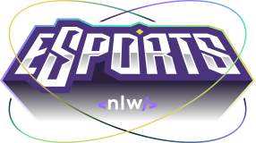
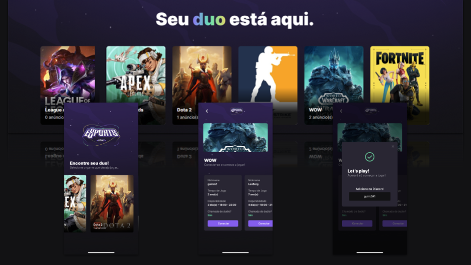

# nlw-esports-ignite


<h1 align="center">  </h1>
 <h3 align="center">:rocket: Project based on challange NLW eSports - Ignite by Rocketseat :rocket:</h3> 


<p align="left">  </p>

<h3 align="left">Description</h3>

[NLW](https://lp.rocketseat.com.br/nlw) is a free programming challange by [Rocketseat](https://rocketseat.com.br/) where people intersting can take a immersive experience in develep world with a active community who ever encourages each others.
<p align="left">The idea of the product developed on this week was provider to players a nice experience to find a duo to play. Share to others players the better day of the week to play and discord id to connect players are some features. </p> 
- This project is based in the challange NLW eSports by Rockseat 
- NLW is a very cool program where we can improve our tech and soft skills
- It have 3 projects: mobile, web and the api backend
<br><br>
<p align="center">  </p>

<h3 align="left">Techs</h3>
<p align="left"> <a href="https://www.docker.com/" target="_blank" rel="noreferrer">  </a> <a href="https://expressjs.com" target="_blank" rel="noreferrer">  </a> <a href="https://nodejs.org" target="_blank" rel="noreferrer">  </a> <a href="https://www.postgresql.org" target="_blank" rel="noreferrer">  </a> <a href="https://reactjs.org/" target="_blank" rel="noreferrer">  </a> <a href="https://reactnative.dev/" target="_blank" rel="noreferrer">  </a> <a href="https://redux.js.org" target="_blank" rel="noreferrer">  </a> <a href="https://tailwindcss.com/" target="_blank" rel="noreferrer">  </a> <a href="https://www.typescriptlang.org/" target="_blank" rel="noreferrer">  </a> </p>

## Getting Started

To clone and run this applications, you will need [docker](https://www.docker.com/get-started/), [git](https://git-scm.com),  [node](https://nodejs.org/en/) & [npm](https://www.npmjs.com/). 
To see the result of mobile application, you will need expo in your mobile see more about [Android](https://play.google.com/store/apps/details?id=host.exp.exponent&hl=pt_BR&gl=US) or [iOS](https://apps.apple.com/br/app/expo-go/id982107779)
<br/>Node version used in this project: `16.14.0`

## Repository

From this repository you clone 3 projects inside the folder esports: api, mobile & web

📦esports

 ┣ 📂api

 ┣ 📂mobile
 
 ┣ 📂web

```bash
# Clone repository
$ git clone https://github.com/guilhermegimenez/nlw-esports-ignite.git
```

## Running project api

From root folder of api project 

📦esports

 ┣ 📂**api**

run the next commands & steps

### first . install dependencies

```bash
# Install all dependencies from package.json
$ npm i
```

### second . config database

The project api was developed to run with [PostgreSQL](https://www.postgresql.org) database.

```bash
# Docker
# Pull PostgreSQL image from Docker Hub
$ docker pull postgres

# Create new container from PostgreSQL image
$ docker run --name nlw-esports -e POSTGRES_USER=nlw -e POSTGRES_PASSWORD=dev -e POSTGRES_DB=nlw -d -p 5432:5432 postgres
```

```bash
# Install migration from prisma
$ npm i @prisma/migrate

# Sync database with schema from /api/prisma/schema.prisma
$ npx prisma migrate dev
```
To connect into others databases search in [prisma](https://www.prisma.io/docs/concepts/database-connectors) about supported databases.

### finally . run api
```bash
# Running api
$ npm run dev
```

## Running project web

From root folder of web project 

📦esports

 ┣ 📂**web**

run the next commands

```bash
# Install all dependencies from package.json
$ npm i

# Run app web
$ npm run dev

# Running in http://127.0.0.1:5173
```

## Running project mobile
- [Expo for Android](https://play.google.com/store/apps/details?id=host.exp.exponent&hl=pt_BR&gl=US)
- [Expo for iOS](https://apps.apple.com/br/app/expo-go/id982107779)

From root folder of mobile project 

📦esports

 ┣ 📂**mobile**

run the next commands

```bash
# Install all dependencies from package.json
$ npm i

# Run mobile app using expo
$ expo start

# Scann the QR Code generated and enjoy
```


- 🌱 I’m currently learning **React and React Native**

- 📫 How to reach me **gimenez.guilhermem@gmail.com**

<h3 align="left">Connect with me:</h3>
<p align="left">
<a href="https://linkedin.com/in/https://www.linkedin.com/in/guilherme-m-gimenez/" target="blank"></a>
<a href="https://discord.gg/guimnZ#7797" target="blank"></a>
</p>
